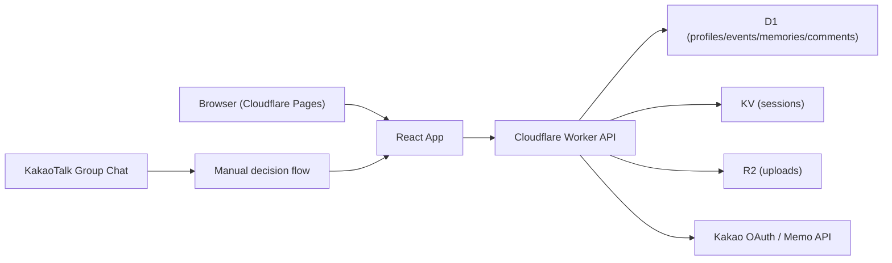

# 06. 아키텍처와 데이터 모델

## 아키텍처 스타일

- 정적 프론트엔드 + Worker 백엔드 + Cloudflare 데이터스토어 조합
- 선택 이유:
  - Pages와 Workers로 프론트/백엔드를 분리해 배포 가능
  - D1, R2, KV로 일정/메모리/세션을 단순하게 분리 가능
  - Kakao OAuth와 relay를 브라우저가 아닌 서버 경계에서 처리 가능

## 시스템 구성도

## 주요 엔티티와 관계

- `profiles`
  - `id`
  - `auth_user_id`
  - `kakao_nickname`
  - `avatar_url`
  - `approval_status`
  - `role`
- `events`
  - `id`
  - `title`
  - `event_at`
  - `location`
  - `what`
  - `how`
  - `decision_summary`
  - `created_by -> profiles.id`
- `memories`
  - `id`
  - `event_id -> events.id`
  - `author_id -> profiles.id`
  - `photo_url`
  - `caption`
  - `recorded_at`
- `comments`
  - `id`
  - `memory_id -> memories.id`
  - `author_id -> profiles.id`
  - `content`
  - `created_at`

## 핵심 제약 조건

- Pages는 프론트 정적 호스팅만 담당
- 인증과 권한은 Worker가 최종 강제
- 승인 여부는 세션 + D1 profile 기준으로 판정
- delete는 운영자만 가능
- 브라우저는 Kakao API를 직접 호출하지 않음

## 품질 속성

- 보안:
  - Kakao secret은 Worker secret으로만 관리
  - request body의 작성자 필드는 권한 근거로 사용하지 않음
- 성능:
  - 이벤트/메모리/코멘트는 단순 CRUD 구조 유지
- 장애 대응:
  - Worker secret 미구성 시 `runtime-status`와 UI 배너로 상태 명시
  - 네트워크 오류는 사용자 메시지로 표기
- 확장성:
  - 카카오 자동화 범위를 늘리더라도 Worker relay 경계를 유지
