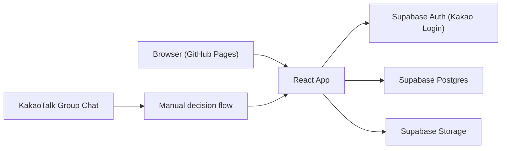

# 06. 아키텍처와 데이터 모델

## 아키텍처 스타일
- 정적 프론트엔드 + BaaS 조합의 서버리스 구조
- 선택 이유:
  - GitHub Pages로 프론트엔드 비용을 낮출 수 있음
  - Supabase가 인증, DB, 스토리지, RLS를 함께 제공
  - 운영자 1인 프로젝트에 적합한 단순 구조

## 시스템 구성도

## 주요 엔티티와 관계
- `profiles`
  - `id`
  - `auth_user_id`
  - `kakao_nickname`
  - `avatar_url`
  - `approval_status`
  - `role`
- `events`
  - `id`
  - `title`
  - `event_at`
  - `location`
  - `what`
  - `how`
  - `decision_summary`
  - `created_by -> profiles.id`
- `memories`
  - `id`
  - `event_id -> events.id`
  - `author_id -> profiles.id`
  - `photo_url`
  - `caption`
  - `recorded_at`
- `comments`
  - `id`
  - `memory_id -> memories.id`
  - `author_id -> profiles.id`
  - `content`
  - `created_at`

## 핵심 제약 조건
- GitHub Pages는 정적 호스팅만 담당
- 인증은 Supabase Kakao OAuth를 통해 처리
- 승인 여부는 앱 로직과 RLS 정책 양쪽에서 확인
- delete는 운영자만 가능

## 품질 속성
- 보안:
  - RLS 필수
  - 운영자 ID 환경변수 별도 관리
- 성능:
  - 이벤트/메모리/코멘트는 단순 select 기반으로 초기 구현
- 장애 대응:
  - Supabase 미설정 시 데모 모드로 폴백
  - 네트워크 오류는 배너로 표기
- 확장성:
  - 카카오 자동화는 차후 별도 계층으로 확장 가능
