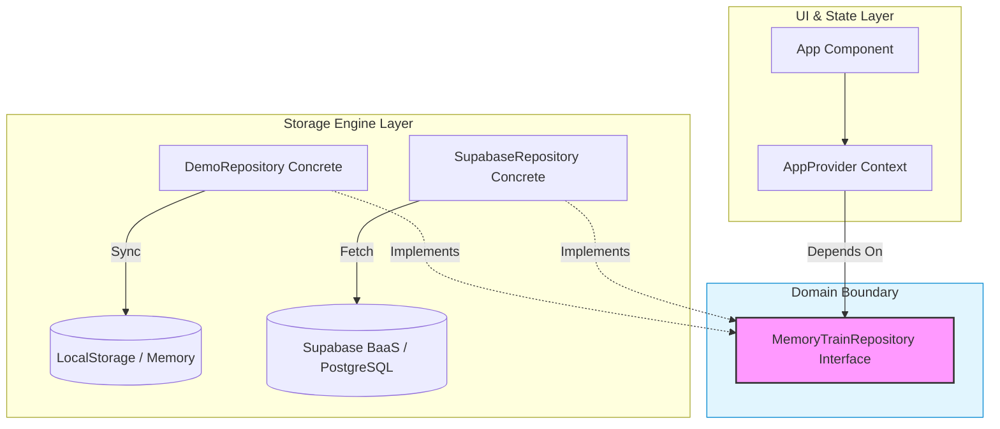
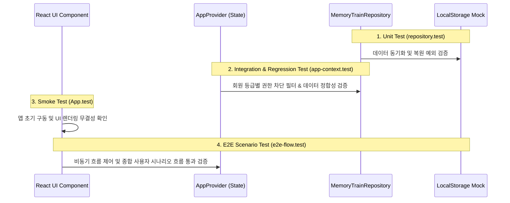

# 설계 / 아키텍처 (Architecture & Design)

본 문서는 `추억열차 (GATTACA)` 프로젝트의 핵심 소프트웨어 구조, 데이터 흐름, 의존성 역전 원칙(DIP) 설계 및 테스트 스위트의 결합 구조를 상세히 정의합니다.

---

## 1. 아키텍처 설계 사상 및 의존성 역전 원칙 (DIP)

추억열차는 UI 비즈니스 정책(Policy)과 물리적인 데이터 저장/통신 기술 메커니즘(Mechanism)을 완벽하게 격리하기 위해 **의존성 역전 원칙(DIP)**을 채택하고 있습니다.

### 💡 핵심 설계 특징
- **도메인 경계 격리**: React 컴포넌트 및 `AppProvider` Context는 구체 스토리지 클래스를 직접 참조하지 않으며, 오직 `MemoryTrainRepository` 인터페이스 규격에만 강하게 의존합니다.
- **스토리지 엔진 주입 (Dependency Injection)**: 런타임 시 구동 모드(데모 모드 혹은 실서버 연동 모드)에 따라 알맞은 리포지토리 인스턴스(`DemoRepository` 또는 `SupabaseRepository`)를 생성하여 `AppProvider` 컨텍스트에 주입하므로 프론트엔드 변경 없이 데이터 레이어를 원천 스위칭할 수 있습니다.
- **Fast Refresh 및 컴파일 가드**: 소스코드 단일 진입점 내 내보내기 충돌 방지를 위해 `react-refresh/only-export-components` ESLint 가드를 안전하게 제어합니다.

---

## 2. 권한 모델 & 상태 가드 게이트 (Access Control)

사용자의 등급 상태(`PENDING`, `APPROVED`, `ADMIN`)에 따라 데이터 생성 및 삭제의 접근 제어를 보장합니다.

| 권한 등급 | 데이터 조회 (Read) | 일정/메모리 추가 (Create) | 삭제/승인 (Delete/Update) | 비고 |
| :--- | :---: | :---: | :---: | :--- |
| **비회원 / 게스트** | ✅ 가능 | ❌ 불가능 | ❌ 불가능 | 데모 모드에서 권한 전환 체험 가능 |
| **PENDING (승인 대기)** | ✅ 가능 | ❌ 불가능 | ❌ 불가능 | 가입 직후 대기 상태 (안내 노출) |
| **APPROVED (승인 회원)** | ✅ 가능 | ✅ 가능 | ❌ 불가능 | 일반 모임 참석자 등급 |
| **ADMIN (운영자)** | ✅ 가능 | ✅ 가능 | ✅ 가능 | 모임 총무/회장 등급 (모든 권한 소유) |

> [!IMPORTANT]
> 본 권한 가드는 `app-context.tsx` 내부 정책 게이트에서 프론트엔드 방어막으로 1차 작동하며, 실제 배포 시에는 Supabase RLS(Row Level Security) 정책 쿼리가 데이터베이스 엔진 단에서 2차로 강제하여 데이터 조작 시도를 원천 봉쇄합니다.

---

## 3. 5단계 다차원 TDD 검증망 구조

아키텍처의 안정성과 Robustness를 담보하기 위해 설계 수준에 따라 테스트 역할을 5단계로 세밀하게 격리 및 맞물리게 구성하였습니다.

### 🧪 테스트 수트 세부 책임
1. **단위 테스트 (Unit)**: `LocalStorage` 및 메모리 동기화 로직과 삭제/수정에 따르는 스토리지 메커니즘 예외 분기 자체를 보증.
2. **통합 테스트 (Integration)**: 주입된 리포지토리 환경에서 컨텍스트의 CRUD 전 흐름 검증.
3. **회귀 테스트 (Regression)**: 레퍼런스 원본 전염에 기인한 테스트 횡적 간섭 버그 방지를 검증.
4. **스모크 테스트 (Smoke)**: 메인 App 컴포넌트의 초기 마운트 및 데모 권한 조작 UI 실시간 바인딩 신속 확인.
5. **E2E 시나리오 테스트 (E2E)**: 가상 브라우저 DOM 쿼리를 사용해 "로그인 ➡️ 일정 추가 ➡️ 상세 조회 ➡️ 사진 및 댓글 등록"에 이르는 통합 유저 저니(User Journey) 전체 통과 보장.
