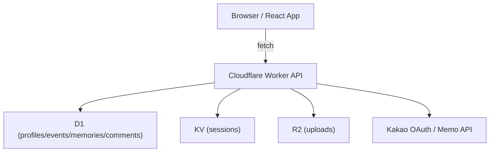

# 설계 / 아키텍처 (Architecture & Design)

이 문서는 `추억열차 (GATTACA)`의 현재 소프트웨어 구조와 책임 경계를 설명합니다. 기준은 과거 Supabase 시도나 데모 프로토타입이 아니라, 지금 저장소에 남아 있는 Cloudflare Worker 기반 실사용 MVP 재구축 상태입니다.

---

## 1. 시스템 개요

추억열차는 두 개의 런타임 축으로 나뉩니다.

1. **프론트엔드**
   - React + Vite
   - Cloudflare Pages 배포
   - 공개 페이지 렌더링, 로그인 유도, 이벤트/메모리/코멘트 UI 제공

2. **백엔드**
   - Cloudflare Workers
   - 인증, 세션, CRUD, 업로드, Kakao relay 제공

스토리지 축은 다음과 같습니다.

- **D1**: 프로필, 이벤트, 메모리, 코멘트
- **KV**: 세션 저장소
- **R2**: 메모리 사진 업로드

---

## 2. 책임 경계

### 2.1 프론트엔드 책임

- 공개 페이지 및 라우팅
- 현재 세션 조회
- 승인 상태에 따른 UI 노출 제어
- 이벤트/메모리/코멘트 작성 폼
- 업로드 및 relay 호출 결과 표시
- Kakao secret 미구성 상태를 사용자에게 명시

프론트는 권한의 최종 결정자가 아닙니다. 권한은 서버에서 다시 강제합니다.

### 2.2 Worker 책임

- `GET /api/health`
- `GET /api/runtime-status`
- `GET /api/session`
- `GET /api/auth/kakao`
- `GET /api/auth/callback`
- `POST /api/auth/logout`
- `POST /api/upload`
- `GET /uploads/<objectKey>`
- `GET /api/profiles`
- `PUT /api/profiles/:id/approval`
- `GET/POST /api/events`
- `PUT/DELETE /api/events/:id`
- `GET/POST /api/memories`
- `PUT/DELETE /api/memories/:id`
- `GET/POST /api/comments`
- `PUT/DELETE /api/comments/:id`
- `POST /api/notifications/kakao-event`

### 2.3 저장소 책임

- D1:
  - `profiles`
  - `events`
  - `memories`
  - `comments`
- KV:
  - session id -> profile snapshot + Kakao access token
- R2:
  - 업로드한 메모리 사진 객체

---

## 3. 아키텍처 흐름



핵심 흐름:

1. 브라우저가 Worker API를 호출한다.
2. Worker가 세션과 권한을 확인한다.
3. CRUD는 D1으로, 세션은 KV로, 사진은 R2로 보낸다.
4. Kakao 로그인과 Kakao memo 전송은 Worker가 중계한다.

---

## 4. 인증 및 세션 구조

Kakao 로그인 흐름:

1. 프론트가 `GET /api/auth/kakao`로 이동
2. Worker가 Kakao authorize URL로 redirect
3. Kakao가 `GET /api/auth/callback`으로 code를 반환
4. Worker가 token 교환 및 user profile 조회
5. Worker가 D1 `profiles`에 upsert
6. Worker가 KV session 생성 및 cookie 발급
7. 프론트는 `GET /api/session`으로 현재 사용자 복원

중요한 점:

- 브라우저는 Kakao REST API를 직접 호출하지 않습니다.
- Kakao access token은 Worker session record에 저장됩니다.
- live 환경에서 `KAKAO_REST_API_KEY`, `KAKAO_CLIENT_SECRET`가 없으면 OAuth는 열리지 않습니다.

---

## 5. 권한 모델

현재 권한 모델은 다음과 같습니다.

| 사용자 상태 | Read | Create / Update | Delete | Approval |
| --- | --- | --- | --- | --- |
| 비로그인 | 공개 읽기만 가능 | 불가 | 불가 | 불가 |
| 승인 대기 | 읽기 가능 | 불가 | 불가 | 불가 |
| 승인 사용자 | 가능 | 가능 | 불가 | 불가 |
| 운영자 | 가능 | 가능 | 가능 | 가능 |

서버 강제 원칙:

- request body의 `createdBy`, `authorId`, `userId`는 신뢰하지 않음
- 세션 사용자 + D1 owner lookup으로 판정
- 프론트 권한 UI는 보조 장치이고 최종 권한은 Worker가 강제

---

## 6. 업로드 및 메모리 구조

사진 업로드 흐름:

1. 승인 사용자가 `POST /api/upload`
2. Worker가 파일 형식과 크기를 검증
3. R2에 저장
4. `publicUrl`을 응답
5. 메모리 생성 시 `photoUrl`로 저장

업로드 제한:

- JPEG / PNG / WEBP
- 최대 5MB

R2 key 규칙:

- `memories/<session-profile-id>/<uuid>.<ext>`

---

## 7. Kakao Relay 구조

Kakao 메시지 relay는 다음 조건을 만족해야 합니다.

- 브라우저가 Kakao API를 직접 호출하지 않음
- 승인 사용자 또는 운영자 세션만 relay 가능
- 세션에 Kakao access token이 없으면 fail-closed
- 이벤트 저장은 Kakao relay 성공 여부에 의존하지 않음
- 이벤트 생성 직후 relay를 자동 호출하지 않음
- Kakao relay는 별도 알림 채널 등록과 명시 전송 기능에서만 호출

현재 남은 외부 블로커:

- `KAKAO_REST_API_KEY`
- `KAKAO_CLIENT_SECRET`

이 두 secret이 live Worker에 주입되면 실제 Kakao 계정 기준 E2E 검증으로 넘어갈 수 있습니다.

---

## 8. 테스트 seam

현재 저장소는 아래 검증 seam을 갖습니다.

- Vitest 단위 테스트
- fake D1 / fake KV / fake R2
- app-context cloudflare mode 테스트
- Worker route 테스트
- `npm run live:check` 기반 live infra readback

대표 검증 명령:

```bash
npm run lint
npm run test
npm run build
npm run worker:deploy:dry-run
npm run live:check -- --api-url https://gattaca-backend.yhh4433.workers.dev
```

---

## 9. 완료 경계

현재 아키텍처 평가는 다음과 같습니다.

- 저장소 내부 구현은 "카카오 API만 붙이면 되는 수준"까지 도달
- 실제 완료 증거는 아직 부족

부족한 마지막 증거:

1. `KAKAO_REST_API_KEY` live 주입
2. `KAKAO_CLIENT_SECRET` live 주입
3. `/api/runtime-status`에서 `auth.kakaoOAuthConfigured=true`
4. 실제 Kakao 로그인 -> session 복원 -> 이벤트 생성 -> 업로드 -> 코멘트 확인
5. Kakao relay 수신 확인은 알림 채널 등록/명시 전송 기능 구현 후 별도 검증
