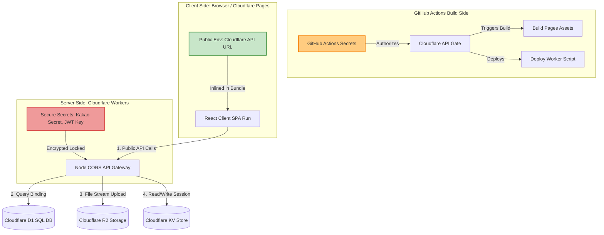

# 인프라 사양 및 연동 가이드 (Infrastructure Specification)

본 문서는 `추억열차(GATTACA)` 프로젝트가 R1 아키텍처(DIP & TDD) 구축 이후 실서버 프로덕션을 위해 연동해야 할 **카카오 API, Cloudflare D1 & R2 & KV, Workers & Pages**에 대한 네이티브 명세서입니다. 사전 지식이 없는 개발자/운영자도 순서대로 실행하면 환경을 완벽하게 재구성할 수 있도록 단계별 가이드를 상세히 기술합니다.

---

## 1. 카카오 API 연동 명세 (Kakao OAuth & Message API)

카카오 로그인 기능과 단톡방 연동(알림 메시지 발송)을 위한 설정 및 REST API 사용법입니다.

### 1.1 Kakao Developers 애플리케이션 생성
1. [Kakao Developers](https://developers.kakao.com/) 포털에 로그인합니다.
2. **[내 애플리케이션]** ➡️ **[애플리케이션 추가하기]**를 클릭합니다.
   - 앱 이름: `추억열차 (GATTACA)`
   - 사업자명: `개인 개발/모임`
3. 생성된 애플리케이션의 **[앱 키]** 메뉴에서 다음 키들을 안전한 곳에 기록해 둡니다:
   - `REST API 키` (Cloudflare Workers 백엔드에서 사용)
   - `JavaScript 키` (React 프론트엔드 SDK에서 사용)

### 1.2 카카오 로그인(OAuth 2.0) 활성화 및 설정
1. **[제품 설정]** ➡️ **[카카오 로그인]**으로 이동하여 **[활성화 설정]**을 `ON`으로 변경합니다.
2. **[Redirect URI]** 메뉴에서 **[등록]**을 클릭하고 다음 주소들을 입력합니다:
   - 로컬 테스트 환경: `http://localhost:5173/oauth/callback`
   - 프로덕션 환경 (Cloudflare Pages): `https://gattaca.pages.dev/oauth/callback`
3. **[동의항목]** 설정으로 이동하여 다음 사용자 정보 권한을 활성화합니다:
   - **프로필 정보(닉네임/프로필 사진)**: 필수 동의 (가입 시 닉네임 표기용)
   - **카카오계정(이메일)**: 선택 동의 (고유 식별자 또는 연락용)

> [!TIP]
> **다중 환경 연동 가이드**: 카카오 Developers는 다수의 Redirect URI 등록을 무제한 지원합니다. 로컬 호스트 주소와 배포 도메인 주소를 한곳에 동시에 등록해 두면, 빌드 시점의 `VITE_CLOUDFLARE_API_URL` 환경 변수 스위칭만으로 환경 간 완벽한 로그인 연동 교차가 가능합니다.

### 1.3 로그인 및 토큰 교환 시퀀스 (REST API)
사용자가 `로그인` 버튼을 누르면 다음 흐름이 발생합니다:

1. **인가 코드(Authorization Code) 요청**:
   - 프론트엔드가 사용자를 아래 주소로 리다이렉트합니다.
   ```text
   GET https://kauth.kakao.com/oauth/authorize?client_id={REST_API_KEY}&redirect_uri={REDIRECT_URI}&response_type=code
   ```
2. **인가 코드 수신**:
   - 인증 완료 후 카카오가 `Redirect URI`로 사용자를 돌려보내며 URL 쿼리 스트링에 `?code={AUTHORIZATION_CODE}`를 전달합니다.
3. **액세스 토큰(Access Token) 발급 및 검증 (CF Worker 위임)**:
   - 프론트엔드는 획득한 `code`를 백엔드(CF Worker)에 전달하고, Worker는 카카오 서버로 다음과 같이 토큰 교환 API를 호출합니다.
   ```text
   POST https://kauth.kakao.com/oauth/token
   Content-Type: application/x-www-form-urlencoded

   grant_type=authorization_code
   &client_id={REST_API_KEY}
   &redirect_uri={REDIRECT_URI}
   &code={AUTHORIZATION_CODE}
   ```
   - 반환받은 `access_token`을 사용해 카카오 사용자 정보 API를 호출하여 고유 ID 및 프로필을 획득합니다:
   ```text
   GET https://kapi.kakao.com/v2/user/me
   Header: Authorization: Bearer {ACCESS_TOKEN}
   ```

### 1.4 나에게 보내기 / 메시지 API (알림 메시지 발송)
일정 확정 시 사용자 카카오톡으로 자동 알림을 전송하는 사양입니다.
- **API 엔드포인트**: `POST https://kapi.kakao.com/v2/api/talk/memo/default/send`
- **헤더**: `Authorization: Bearer {USER_ACCESS_TOKEN}`
- **전송 바디(x-www-form-urlencoded)**:
  ```text
  template_object={
    "object_type": "text",
    "text": "[추억열차] 새로운 모임 일정 '5월 정기 모임'이 확정되었습니다! 지금 접속하여 추억을 등록해 보세요.",
    "link": {
      "web_url": "https://gattaca.pages.dev",
      "mobile_web_url": "https://gattaca.pages.dev"
    },
    "button_title": "열차 타러 가기"
  }
  ```

---

## 2. Cloudflare D1 분산 SQL & R2 Storage 사양 명세

클라우드플레어의 완전 서버리스 인프라를 활용하여 실시간 관계형 데이터 보존 및 초저지연 스토리지 파일 연동을 제어하기 위한 상세 명세입니다.

### 2.1 Cloudflare D1 데이터베이스 스키마 설계 및 SQL DDL
Cloudflare D1 SQL 대시보드 또는 wrangler CLI를 통해 다음 SQLite 호환 테이블들을 생성 및 마이그레이션합니다.

```sql
-- 1. 사용자 프로필 테이블 (approval_status: pending, approved, rejected)
CREATE TABLE IF NOT EXISTS profiles (
    id TEXT PRIMARY KEY NOT NULL,
    auth_user_id TEXT UNIQUE NOT NULL,
    kakao_nickname TEXT NOT NULL,
    avatar_url TEXT NOT NULL,
    approval_status TEXT DEFAULT 'pending' CHECK (approval_status IN ('pending', 'approved', 'rejected')),
    role TEXT DEFAULT 'member' CHECK (role IN ('member', 'admin')),
    created_at TIMESTAMP DEFAULT CURRENT_TIMESTAMP NOT NULL
);

-- 2. 추억 일정(이벤트) 테이블
CREATE TABLE IF NOT EXISTS events (
    id TEXT PRIMARY KEY NOT NULL,
    title TEXT NOT NULL,
    event_at TEXT NOT NULL,
    location TEXT NOT NULL,
    what TEXT NOT NULL,
    how TEXT NOT NULL,
    decision_summary TEXT NOT NULL,
    created_by TEXT REFERENCES profiles(id) NOT NULL,
    created_at TIMESTAMP DEFAULT CURRENT_TIMESTAMP NOT NULL
);

-- 3. 추억 사진 메모리 테이블
CREATE TABLE IF NOT EXISTS memories (
    id TEXT PRIMARY KEY NOT NULL,
    event_id TEXT REFERENCES events(id) ON DELETE CASCADE NOT NULL,
    author_id TEXT REFERENCES profiles(id) NOT NULL,
    photo_url TEXT NOT NULL,
    caption TEXT NOT NULL,
    recorded_at TEXT NOT NULL,
    created_at TIMESTAMP DEFAULT CURRENT_TIMESTAMP NOT NULL
);

-- 4. 댓글 코멘트 테이블
CREATE TABLE IF NOT EXISTS comments (
    id TEXT PRIMARY KEY NOT NULL,
    memory_id TEXT REFERENCES memories(id) ON DELETE CASCADE NOT NULL,
    author_id TEXT REFERENCES profiles(id) NOT NULL,
    content TEXT NOT NULL,
    created_at TEXT DEFAULT CURRENT_TIMESTAMP NOT NULL
);
```

### 2.2 Cloudflare R2 스토리지 업로드 명세
추억 사진 파일을 저장하고 글로벌 CDN 무상 서빙을 극대화하기 위한 파일 스토리지 명세입니다.
1. Cloudflare 대시보드 ➡️ **[R2 스토리지]** ➡️ **[버킷 생성] (Create bucket)**을 클릭하여 `memory-photos` 버킷을 생성합니다.
2. **Allowed MIME types**: `image/jpeg`, `image/png`, `image/webp` (용량 제한: 파일당 최대 5MB).
3. **CORS 정책**:
   - `Allowed Origins`: `http://localhost:5173`, `https://*.pages.dev`
   - `Allowed Methods`: `GET`, `POST`, `PUT`, `DELETE`

---

## 3. Cloudflare Workers & Pages 명세 (Deployment & Backend Binding)

서버리스 인프라인 Cloudflare를 활용하여 고성능 프론트엔드 정적 웹 서빙과 안전한 백엔드 API Gateway 환경을 구축하는 가이드입니다.

### 3.1 Cloudflare Pages (프론트엔드 React SPA 배포)
Vite 기반 React 프론트엔드 소스 코드를 글로벌 Edge CDN에 배포하는 순서입니다.

1. Cloudflare 대시보드 로그인 ➡️ **[Workers & Pages]** ➡️ **[Pages]** ➡️ **[Create a project]** ➡️ **[Connect to Git]** 클릭.
2. GATTACA GitHub 레포지토리를 연결하고 빌드 세팅을 다음과 같이 적용합니다:
   - **Framework preset**: `Vite`
   - **Build command**: `npm run build`
   - **Build output directory**: `dist`
3. **[Environment variables]** (빌드 환경 변수) 등록:
   - `VITE_CLOUDFLARE_API_URL` = `https://gattaca-backend.your-subdomain.workers.dev` (이하 Workers 주소)

> [!IMPORTANT]
> **SPA 라우팅 Redirect 설정**: Cloudflare Pages에서 React-Router 리다이렉트 시 404 에러 방지를 위해, 프로젝트 루트(`public/`) 디렉토리에 `_redirects` 파일을 만들어 아래 내용을 기재해야 합니다:
> ```text
> /*    /index.html   200
> ```

### 3.2 Cloudflare Workers (D1/R2/KV 통합 백엔드)
클라이언트 측에 민감한 API Key나 DB 커넥션 보안 유지를 위해 Workers를 통합 서버리스 에지 서버로 구성합니다.

#### 1. Worker 생성 및 wrangler 설정 (`wrangler.toml` 예시)
```toml
name = "gattaca-backend"
main = "src/index.ts"
compatibility_date = "2026-05-31"

# 1. D1 Database 바인딩
[[d1_databases]]
binding = "DB"
database_name = "gattaca-d1"
database_id = "your-d1-uuid-here"

# 2. KV Namespace 바인딩
[[kv_namespaces]]
binding = "SESSION"
namespace_id = "your-kv-uuid-here"

# 3. R2 Storage 바인딩
[[r2_buckets]]
binding = "BUCKET"
bucket_name = "memory-photos"
```

#### 2. Cloudflare Workers Secrets 등록 (카카오 API 민감 키 격리)
카카오 로그인 인가 코드를 토큰으로 교환하거나, 알림 메시지를 비동기 발송할 때 필요한 민감한 키들은 보안 경계 격리 원칙에 따라 GitHub Secrets가 아닌 **Cloudflare Workers Secrets**에 직접 암호화 등록하여 런타임에 휘발성으로 사용합니다.

**[A] Wrangler CLI를 통한 로컬 주입 방법 (개발자 권장)**
터미널에서 Workers 백엔드 프로젝트 디렉토리로 이동한 후 아래 wrangler 명령어를 실행하여 보안 변수를 추가합니다.
```bash
# 1. 카카오 REST API 키 등록
npx wrangler secret put KAKAO_REST_API_KEY

# 2. 카카오 OAuth Client Secret 등록 (활성화한 경우 필수)
npx wrangler secret put KAKAO_CLIENT_SECRET
```
*실행 후 터미널 메시지에 따라 주입할 실제 카카오 키 값을 복사-붙여넣기 하면 보안 락다운이 완료됩니다.*

**[B] Cloudflare 대시보드를 통한 주입 방법 (운영자 권장)**
1. [Cloudflare Dashboard](https://dash.cloudflare.com/) ➡️ **[Workers & Pages]** ➡️ **[Overview]** 메뉴로 이동합니다.
2. 배포된 `gattaca-backend` Worker를 클릭합니다.
3. 상단 탭에서 **[Settings]** ➡️ **[Variables]** 메뉴를 차례대로 선택합니다.
4. **[Environment Variables]** 섹션 하단의 **[Add variable]** 버튼을 클릭합니다.
5. 아래 키명으로 등록하고 반드시 **[Encrypt]** (자물쇠 아이콘)를 클릭해 시크릿(Secrets) 형태로 암호화 락다운합니다:
   - **Name**: `KAKAO_REST_API_KEY` ➡️ **Value**: 카카오 REST API 키 기입
   - **Name**: `KAKAO_CLIENT_SECRET` ➡️ **Value**: 카카오 Client Secret 기입
6. 우측 하단의 **[Save and deploy]** 버튼을 눌러 변경을 실서버 컨테이너에 반영합니다.

---

## 4. CI/CD 및 배포 시크릿 키(Secret Keys) 발급 및 등록 가이드

사전 지식이 없는 비전문가도 따라 하여 GitHub 자동 배포(GitHub Actions)와 Cloudflare Secrets 시스템을 구축할 수 있는 초정밀 가이드라인입니다.

### 4.1 Cloudflare API Token & Account ID 발급
GitHub Actions 자동 빌드 및 배포 파이프라인에서 Cloudflare 자원을 제어할 수 있도록 인증 수단을 획득하는 과정입니다.

#### [A] Cloudflare API Token (보안 인증 키) 발급
1. [Cloudflare Dashboard](https://dash.cloudflare.com/)에 로그인합니다.
2. 메인 화면 우측 상단의 **[사용자 프로필] (My Profile)** 아이콘을 클릭한 뒤, **[API 토큰] (API Tokens)** 메뉴를 선택합니다.
3. **[토큰 생성] (Create Token)** 버튼을 클릭합니다.
4. 여러 템플릿 목록 중 **[Edit Cloudflare Workers] (Cloudflare Workers 편집)** 오른쪽의 **[템플릿 사용] (Use template)** 버튼을 클릭합니다.
5. **[Permissions] (권한)** 설정 섹션에서 다음 두 권한 항목이 존재하는지 확인하고 추가/유지합니다:
   - `Account` ➡️ `Cloudflare Pages` ➡️ `Edit` (Pages 자동 배포 제어 권한)
   - `Account` ➡️ `Workers Scripts` ➡️ `Edit` (Workers 서버리스 코드 배포 권한)
6. **[Account Resources]**를 `All accounts`로, **[Zone Resources]**를 `All zones`로 설정합니다.
7. 페이지 최하단의 **[요약 페이지로 이동] (Continue to summary)** 버튼을 누르고, 최종 확인 후 **[토큰 생성] (Create Token)** 버튼을 클릭합니다.
8. 화면에 생성되어 나타나는 매우 긴 암호화 문자열(API Token)을 **[Copy]** 하여 메모장 등 안전한 곳에 즉시 보관합니다.

#### [B] Cloudflare Account ID (계정 ID) 확인
1. Cloudflare 대시보드 메인 페이지로 이동합니다.
2. 대시보드 화면 우측 패널의 **[계정 ID] (Account ID)** 영역에 표시된 32자리 난수 값을 찾아 복사하여 안전하게 보관합니다.

---

### 4.2 GitHub Actions (CI/CD) Secrets 등록
코드 푸시 시 자동으로 Pages 정적 빌드 및 배포가 수행되도록 GitHub에 클라우드 토큰을 바인딩하는 방법입니다.

1. 본인의 GitHub `GATTACA` 저장소 웹 페이지로 이동합니다.
2. 상단 탭 목록 우측 끝에 위치한 **[Settings]** (톱니바퀴 모양 아이콘)를 클릭합니다.
3. 좌측 사이드바 메뉴 하단에서 **[Secrets and variables]** ➡️ **[Actions]**를 차례대로 선택합니다.
4. **[New repository secret]** (초록색 버튼)을 클릭합니다.
5. 다음 암호화 보안 변수 및 빌드 타임 환경 변수들을 각각 추가합니다 (GitHub Secrets에는 Vite 클라이언트 전용 접두사인 `VITE_`를 제거하고 순수 변수명으로 등록해야 하며, CI/CD 빌드 시점에 Actions가 접두사를 붙여 자동 바인딩합니다):
   - **Name**: `CLOUDFLARE_API_TOKEN`
     - **Value**: Cloudflare API Token 문자열 붙여넣기 (배포 인증용)
   - **Name**: `CLOUDFLARE_ACCOUNT_ID`
     - **Value**: 32자리 Account ID 문자열 붙여넣기 (배포 타깃 계정 식별용)
   - **Name**: `CLOUDFLARE_API_URL`
     - **Value**: Cloudflare Workers 백엔드 API Gateway 주소 (`https://gattaca-backend.your-subdomain.workers.dev`) 등록 (Vite 정적 빌드 타임 자동 주입용)
   - **Name**: `ADMIN_USER_ID`
     - **Value**: 운영자 사용자 고유 ID 등록 (필요시 빌드 타임 주입)

---

## 5. 🛡️ 보안 및 배포의 아키텍처적 경계 명세 (Security & Deployment Boundary)

본 장은 **"왜 어떤 값은 Pages에 들어가고, 어떤 값은 Workers에 들어가며, 깃허브 시크릿은 어떤 역할을 전담하는가?"**에 대한 시스템 아키텍처적 경계선과 격리 설계를 명확히 규정합니다.



### 5.1 런타임 보안 경계 (왜 Pages와 Workers의 변수를 분리하는가?)
- **클라이언트 사이드 (Cloudflare Pages)**: 
  - React SPA 코드는 브라우저(User's Device)로 통째로 내려가서 실행됩니다. `VITE_CLOUDFLARE_API_URL`과 같은 변수는 빌드 컴파일 시점에 자바스크립트 텍스트 번들에 그대로 **인라이닝(Inlining)**되어 박제됩니다.
  - 즉, 사용자가 개발자 도구(F12)나 소스코드 네트워크 탭만 열어도 즉시 이 값을 추출해낼 수 있습니다. 따라서 노출되어도 무방한 **퍼블릭 정보(Public Keys/URLs)**만 Pages에 격리 주입합니다.
- **서버 사이드 (Cloudflare Workers)**:
  - 브라우저에 노출되는 순간 데이터베이스 전체 통제권을 상실하는 **초민감 마스터 키(`KAKAO_CLIENT_SECRET`, `JWT_SECRET_KEY`)**는 브라우저로 단 1바이트도 유출되어서는 안 됩니다.
  - 이 값들은 오직 Cloudflare의 서버리스 Edge 컨테이너 내부 환경변수에만 **비공개 암호화 락다운(Secrets Lock)** 처리되어 탑재되며, Workers 백엔드 서버 로직 내부에서만 실행 후 휘발되므로 클라이언트 사이드로의 유출이 100% 원천 차단됩니다.

### 5.2 CI/CD 통합 배포 경계 (GitHub Secrets를 통한 원스톱 빌드 및 배포 무인화)
- **GitHub Secrets 기반의 통합 주입 (Single Source of Truth)**:
  - 기존에는 배포 패스포트용 토큰(`CLOUDFLARE_API_TOKEN`, `CLOUDFLARE_ACCOUNT_ID`)만 GitHub에 등록하고, 빌드 환경 변수는 Cloudflare Dashboard 등에서 수동 바인딩하는 복잡한 단계를 거쳤습니다.
  - 하지만 이제 **GitHub Secrets에 Cloudflare 배포 키와 빌드 타임 환경 변수(`CLOUDFLARE_API_URL`)를 통합 등록**하여 완전 무인화된 CI/CD 파이프라인을 구성합니다.
  - **VITE 접두사 배제 정책**: 깃허브 저장소 Secrets는 클라이언트 프레임워크나 특정 빌드 도구(Vite)에 종속되지 않는 순수한 인프라 리소스 값으로 보관되어야 하므로, 접두사 `VITE_`를 제거한 표준 이름(`CLOUDFLARE_API_URL`)으로 깨끗하게 보관합니다.
  - 배포 파이프라인(GitHub Actions)은 빌드 단계(`env`)에서 해당 Secrets를 끌어와 Vite 번들러가 컴파일 인라이닝할 수 있도록 접두사를 매핑 주입(`VITE_CLOUDFLARE_API_URL: ${{ secrets.CLOUDFLARE_API_URL }}`)해줌으로써 최종 정적 에셋 번들 내부에 안전하게 인라이닝 처리합니다.
- **런타임 컨테이너 환경 변수와 빌드 타임 변수의 경계**:
  - React SPA 정적 에셋 빌드에 필요한 변수는 GitHub Actions 파이프라인 시점에 GitHub Secrets에서 꺼내어 번들에 즉시 주입(Inlining)되므로, 번거롭고 실수하기 쉬운 Cloudflare Dashboard 수동 설정을 완전히 배제할 수 있습니다.
  - 단, 백엔드 서버 런타임(Workers) 내부에서 구동되는 초민감 3자 인증 키(`KAKAO_CLIENT_SECRET` 등)는 여전히 Cloudflare Workers Settings Secrets에 암호화 락다운 처리되어 런타임에 에지 컨테이너 환경 변수로 직접 참조되는 이원적 보안 경계를 안전하게 고수합니다.

