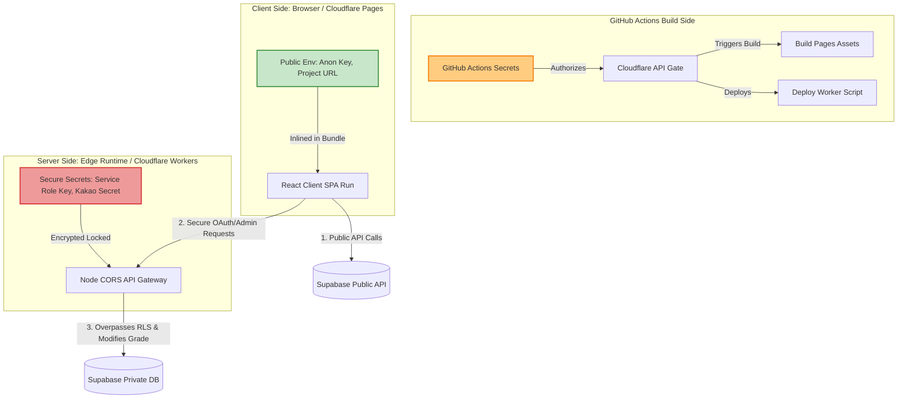

# 인프라 사양 및 연동 가이드 (Infrastructure Specification)

본 문서는 `추억열차(GATTACA)` 프로젝트가 R1 아키텍처(DIP & TDD) 구축 이후 실서버 프로덕션을 위해 연동해야 할 **카카오 API, Supabase, Cloudflare Workers & Pages**에 대한 명세서입니다. 사전 지식이 없는 개발자/운영자도 순서대로 실행하면 환경을 완벽하게 재구성할 수 있도록 단계별 가이드를 상세히 기술합니다.

---

## 1. 카카오 API 연동 명세 (Kakao OAuth & Message API)

카카오 로그인 기능과 단톡방 연동(알림 메시지 발송)을 위한 설정 및 REST API 사용법입니다.

### 1.1 Kakao Developers 애플리케이션 생성
1. [Kakao Developers](https://developers.kakao.com/) 포털에 로그인합니다.
2. **[내 애플리케이션]** ➡️ **[애플리케이션 추가하기]**를 클릭합니다.
   - 앱 이름: `추억열차 (GATTACA)`
   - 사업자명: `개인 개발/모임`
3. 생성된 애플리케이션의 **[앱 키]** 메뉴에서 다음 키들을 안전한 곳에 기록해 둡니다:
   - `REST API 키` (Cloudflare Workers 백엔드에서 사용)
   - `JavaScript 키` (React 프론트엔드 SDK에서 사용)

### 1.2 카카오 로그인(OAuth 2.0) 활성화 및 설정
1. **[제품 설정]** ➡️ **[카카오 로그인]**으로 이동하여 **[활성화 설정]**을 `ON`으로 변경합니다.
2. **[Redirect URI]** 메뉴에서 **[등록]**을 클릭하고 다음 주소들을 입력합니다:
   - 로컬 테스트 환경: `http://localhost:5173/oauth/callback`
   - 프로덕션 환경 (Cloudflare Pages): `https://gattaca.pages.dev/oauth/callback`
3. **[동의항목]** 설정으로 이동하여 다음 사용자 정보 권한을 활성화합니다:
   - **프로필 정보(닉네임/프로필 사진)**: 필수 동의 (가입 시 닉네임 표기용)
   - **카카오계정(이메일)**: 선택 동의 (고유 식별자 또는 연락용)

> [!TIP]
> **다중 환경 연동 가이드**: 카카오 Developers는 다수의 Redirect URI 등록을 무제한 지원합니다. 로컬 호스트 주소와 배포 도메인 주소를 한곳에 동시에 등록해 두면, 빌드 시점의 `VITE_API_BASE_URL` 환경 변수 스위칭만으로 환경 간 완벽한 로그인 연동 교차가 가능합니다.

### 1.3 로그인 및 토큰 교환 시퀀스 (REST API)
사용자가 `로그인` 버튼을 누르면 다음 흐름이 발생합니다:

1. **인가 코드(Authorization Code) 요청**:
   - 프론트엔드가 사용자를 아래 주소로 리다이렉트합니다.
   ```text
   GET https://kauth.kakao.com/oauth/authorize?client_id={REST_API_KEY}&redirect_uri={REDIRECT_URI}&response_type=code
   ```
2. **인가 코드 수신**:
   - 인증 완료 후 카카오가 `Redirect URI`로 사용자를 돌려보내며 URL 쿼리 스트링에 `?code={AUTHORIZATION_CODE}`를 전달합니다.
3. **액세스 토큰(Access Token) 발급 (Cloudflare Worker 위임)**:
   - 프론트엔드는 획득한 `code`를 백엔드(CF Worker)에 전달하고, Worker는 카카오 서버로 다음과 같이 토큰 교환 API를 호출합니다.
   ```text
   POST https://kauth.kakao.com/oauth/token
   Content-Type: application/x-www-form-urlencoded

   grant_type=authorization_code
   &client_id={REST_API_KEY}
   &redirect_uri={REDIRECT_URI}
   &code={AUTHORIZATION_CODE}
   ```
   - 반환받은 `access_token`을 사용해 카카오 사용자 정보 API를 호출하여 고유 ID 및 프로필을 획득합니다:
   ```text
   GET https://kapi.kakao.com/v2/user/me
   Header: Authorization: Bearer {ACCESS_TOKEN}
   ```

### 1.4 나에게 보내기 / 메시지 API (알림 메시지 발송)
일정 확정 시 사용자 카카오톡으로 자동 알림을 전송하는 사양입니다.
- **API 엔드포인트**: `POST https://kapi.kakao.com/v2/api/talk/memo/default/send`
- **헤더**: `Authorization: Bearer {USER_ACCESS_TOKEN}`
- **전송 바디(x-www-form-urlencoded)**:
  ```text
  template_object={
    "object_type": "text",
    "text": "[추억열차] 새로운 모임 일정 '5월 정기 모임'이 확정되었습니다! 지금 접속하여 추억을 등록해 보세요.",
    "link": {
      "web_url": "https://gattaca.pages.dev",
      "mobile_web_url": "https://gattaca.pages.dev"
    },
    "button_title": "열차 타러 가기"
  }
  ```

---

## 2. Supabase 사양 명세 (PostgreSQL DB, RLS, Storage)

Supabase BaaS 인프라를 활용하여 실시간 관계형 데이터 보존 및 보안 필터를 구현하기 위한 상세 설정 명세입니다.

### 2.1 데이터베이스 스키마 설계 및 DDL SQL
Supabase **[SQL Editor]**를 통해 다음 테이블들을 직접 생성합니다.

```sql
-- 1. 사용자 테이블 (member_grade: PENDING, APPROVED, ADMIN)
CREATE TABLE public.members (
    id UUID REFERENCES auth.users NOT NULL PRIMARY KEY,
    kakao_id VARCHAR(255) UNIQUE NOT NULL,
    nickname VARCHAR(100) NOT NULL,
    avatar_url TEXT,
    grade VARCHAR(20) DEFAULT 'PENDING' CHECK (grade IN ('PENDING', 'APPROVED', 'ADMIN')),
    created_at TIMESTAMP WITH TIME ZONE DEFAULT TIMEZONE('utc'::text, NOW()) NOT NULL
);

-- 2. 추억 일정(이벤트) 테이블
CREATE TABLE public.memories (
    id UUID DEFAULT gen_random_uuid() PRIMARY KEY,
    title VARCHAR(255) NOT NULL,
    description TEXT,
    event_date DATE NOT NULL,
    image_url TEXT,
    created_by UUID REFERENCES public.members(id) NOT NULL,
    created_at TIMESTAMP WITH TIME ZONE DEFAULT TIMEZONE('utc'::text, NOW()) NOT NULL
);

-- 3. 코멘트 테이블
CREATE TABLE public.comments (
    id UUID DEFAULT gen_random_uuid() PRIMARY KEY,
    memory_id UUID REFERENCES public.memories(id) ON DELETE CASCADE NOT NULL,
    content TEXT NOT NULL,
    created_by UUID REFERENCES public.members(id) NOT NULL,
    created_at TIMESTAMP WITH TIME ZONE DEFAULT TIMEZONE('utc'::text, NOW()) NOT NULL
);
```

### 2.2 행 단위 보안 정책 (Row Level Security - RLS)
회원 권한 등급에 따른 데이터 쓰기/삭제 분리 가드를 DB 레벨에서 강제하기 위한 핵심 정책입니다. RLS 활성화 및 세부 정책 정책 SQL입니다.

```sql
-- RLS 활성화
ALTER TABLE public.members ENABLE ROW LEVEL SECURITY;
ALTER TABLE public.memories ENABLE ROW LEVEL SECURITY;
ALTER TABLE public.comments ENABLE ROW LEVEL SECURITY;

-- [A. Members 테이블 보안 정책]
-- 1. 본인 정보는 가입 신청(Insert) 및 조회(Select) 가능
CREATE POLICY "Allow members profile insert" ON public.members 
    FOR INSERT WITH CHECK (auth.uid() = id);

CREATE POLICY "Allow members profile select" ON public.members 
    FOR SELECT USING (true);

-- 2. 회원 등급 변경은 ADMIN(운영자)만 가능
CREATE POLICY "Allow only admin update members" ON public.members 
    FOR UPDATE USING (
        EXISTS (
            SELECT 1 FROM public.members 
            WHERE id = auth.uid() AND grade = 'ADMIN'
        )
    );

-- [B. Memories 테이블 보안 정책]
-- 1. 모든 접속자(비승인 포함)는 일정 조회가 가능함
CREATE POLICY "Allow all select memories" ON public.memories 
    FOR SELECT USING (true);

-- 2. APPROVED(승인 회원) 또는 ADMIN(운영자) 등급만 일정 등록(Insert)이 가능함
CREATE POLICY "Allow approved members insert memories" ON public.memories 
    FOR INSERT WITH CHECK (
        EXISTS (
            SELECT 1 FROM public.members 
            WHERE id = auth.uid() AND grade IN ('APPROVED', 'ADMIN')
        )
    );

-- 3. 삭제(Delete)는 ADMIN(운영자)만 가능함
CREATE POLICY "Allow only admin delete memories" ON public.memories 
    FOR DELETE USING (
        EXISTS (
            SELECT 1 FROM public.members 
            WHERE id = auth.uid() AND grade = 'ADMIN'
        )
    );

-- [C. Comments 테이블 보안 정책]
-- 1. 모든 접속자는 코멘트 조회가 가능함
CREATE POLICY "Allow all select comments" ON public.comments 
    FOR SELECT USING (true);

-- 2. APPROVED(승인 회원) 또는 ADMIN(운영자) 등급만 코멘트 등록이 가능함
CREATE POLICY "Allow approved members insert comments" ON public.comments 
    FOR INSERT WITH CHECK (
        EXISTS (
            SELECT 1 FROM public.members 
            WHERE id = auth.uid() AND grade IN ('APPROVED', 'ADMIN')
        )
    );
```

### 2.3 Supabase Storage 업로드 명세
추억 사진 파일을 저장하고 공용 URL로 서빙하기 위한 파일 스토리지 명세입니다.
1. Supabase 대시보드에서 **[Storage]** 메뉴로 이동합니다.
2. **[New bucket]**을 클릭하여 `memory-images` 버킷을 생성합니다.
   - **Public bucket** 옵션을 `ON`으로 활성화하여 누구나 사진을 조회할 수 있도록 구성합니다.
3. 스토리지 RLS 정책 설정 (**[Policies]** ➡️ **[memory-images]**):
   - **Insert (업로드)**: `auth.role() = 'authenticated'` 인 사용자 중 회원 등급이 `APPROVED` 혹은 `ADMIN`인 사용자만 업로드 허용.
   - **Allowed MIME types**: `image/jpeg`, `image/png`, `image/webp` (용량 제한: 파일당 최대 5MB).

---

## 3. Cloudflare Workers & Pages 명세 (Deployment & Backend Proxy)

서버리스 인프라인 Cloudflare를 활용하여 고성능 프론트엔드 정적 웹 서빙과 안전한 백엔드 API Gateway 환경을 구축하는 가이드입니다.

### 3.1 Cloudflare Pages (프론트엔드 React SPA 배포)
Vite 기반 React 프론트엔드 소스 코드를 글로벌 Edge CDN에 배포하는 순서입니다.

1. Cloudflare 대시보드 로그인 ➡️ **[Workers & Pages]** ➡️ **[Pages]** ➡️ **[Create a project]** ➡️ **[Connect to Git]** 클릭.
2. GATTACA GitHub 레포지토리를 연결하고 빌드 세팅을 다음과 같이 적용합니다:
   - **Framework preset**: `Vite`
   - **Build command**: `npm run build`
   - **Build output directory**: `dist`
3. **[Environment variables]** (빌드 환경 변수) 등록:
   - `VITE_SUPABASE_URL` = `https://your-supabase-project.supabase.co`
   - `VITE_SUPABASE_ANON_KEY` = `your-anon-key-here`
   - `VITE_API_BASE_URL` = `https://gattaca-backend.your-subdomain.workers.dev` (이하 3.2 단계의 CF Workers 주소)

> [!IMPORTANT]
> **SPA 라우팅 Redirect 설정**: Cloudflare Pages에서 React-Router 리다이렉트 시 404 에러 방지를 위해, 프로젝트 루트(`public/`) 디렉토리에 `_redirects` 파일을 만들어 아래 내용을 기재해야 합니다:
> ```text
> /*    /index.html   200
> ```

### 3.2 Cloudflare Workers (백엔드 프록시 및 관리 API)
클라이언트 측에 민감한 API Key(예: Supabase Service Role Key, 카카오 Client Secret)를 노출하지 않기 위해 Workers를 프록시 백엔드로 배치합니다.

#### 1. Worker 생성 및 wrangler 설정 (`wrangler.toml` 예시)
프로젝트 루트 또는 독립된 `backend/` 폴더에 Cloudflare wrangler 설정을 배치합니다.

```toml
name = "gattaca-backend"
main = "src/index.ts"
compatibility_date = "2026-05-31"

[vars]
SUPABASE_URL = "https://your-supabase-project.supabase.co"
```

> [!WARNING]
> **Cloudflare Workers V8 Edge Runtime (호환성 주의사항)**: Cloudflare Workers는 Node.js 풀 런타임이 아닌 V8 샌드박스 엣지 환경에서 구동됩니다. Supabase JS SDK 연결 시 Node.js 전용 모듈(`fs`, `net` 등)이 호출되지 않도록 `wrangler.toml`에 아래의 호환성 플래그를 추가해야 비동기 페치 에러가 방지됩니다:
> ```toml
> compatibility_flags = [ "nodejs_compat" ]
> ```

---

## 4. CI/CD 및 배포 시크릿 키(Secret Keys) 발급 및 등록 가이드

사전 지식이 없는 비전문가도 따라 하여 GitHub 자동 배포(GitHub Actions)와 Cloudflare Secrets 시스템을 구축할 수 있는 초정밀 가이드라인입니다.

### 4.1 Cloudflare API Token & Account ID 발급
GitHub Actions 자동 빌드 및 배포 파이프라인에서 Cloudflare 자원을 제어할 수 있도록 인증 수단을 획득하는 과정입니다.

#### [A] Cloudflare API Token (보안 인증 키) 발급
1. [Cloudflare Dashboard](https://dash.cloudflare.com/)에 로그인합니다.
2. 메인 화면 우측 상단의 **[사용자 프로필] (My Profile)** 아이콘을 클릭한 뒤, **[API 토큰] (API Tokens)** 메뉴를 선택합니다.
3. **[토큰 생성] (Create Token)** 버튼을 클릭합니다.
4. 여러 템플릿 목록 중 **[Edit Cloudflare Workers] (Cloudflare Workers 편집)** 오른쪽의 **[템플릿 사용] (Use template)** 버튼을 클릭합니다.
5. **[Permissions] (권한)** 설정 섹션에서 다음 두 권한 항목이 존재하는지 확인하고 추가/유지합니다:
   - `Account` ➡️ `Cloudflare Pages` ➡️ `Edit` (Pages 자동 배포 제어 권한)
   - `Account` ➡️ `Workers Scripts` ➡️ `Edit` (Workers 서버리스 코드 배포 권한)
6. **[Account Resources]**를 `All accounts`로, **[Zone Resources]**를 `All zones`로 설정합니다.
7. 페이지 최하단의 **[요약 페이지로 이동] (Continue to summary)** 버튼을 누르고, 최종 확인 후 **[토큰 생성] (Create Token)** 버튼을 클릭합니다.
8. 화면에 생성되어 나타나는 매우 긴 암호화 문자열(API Token)을 **[Copy]** 하여 메모장 등 안전한 곳에 즉시 보관합니다. *(이 토큰은 다시 조회할 수 없으므로 반드시 한 번에 안전하게 백업해야 합니다.)*

#### [B] Cloudflare Account ID (계정 ID) 확인
1. Cloudflare 대시보드 메인 페이지로 이동합니다.
2. 대시보드 화면 우측 패널의 **[계정 ID] (Account ID)** 영역에 표시된 32자리 난수 값을 찾아 복사하여 안전하게 보관합니다.

---

### 4.2 GitHub Actions (CI/CD) Secrets 등록
코드 푸시 시 자동으로 Pages 정적 빌드 및 배포가 수행되도록 GitHub에 클라우드 토큰을 바인딩하는 방법입니다.

1. 본인의 GitHub `GATTACA` 저장소 웹 페이지로 이동합니다.
2. 상단 탭 목록 우측 끝에 위치한 **[Settings]** (톱니바퀴 모양 아이콘)를 클릭합니다.
3. 좌측 사이드바 메뉴 하단에서 **[Secrets and variables]** ➡️ **[Actions]**를 차례대로 선택합니다.
4. **[New repository secret]** (초록색 버튼)을 클릭합니다.
5. 다음 두 개의 암호화 보안 변수를 각각 추가합니다:
   - **첫 번째 Secret**:
     - **Name**: `CLOUDFLARE_API_TOKEN`
     - **Value**: (위 4.1-[A] 단계에서 안전하게 보존한 Cloudflare API Token 문자열 붙여넣기)
   - **두 번째 Secret**:
     - **Name**: `CLOUDFLARE_ACCOUNT_ID`
     - **Value**: (위 4.1-[B] 단계에서 보존한 32자리 Account ID 문자열 붙여넣기)
6. 등록이 완료되면, 메인 레포의 `.github/workflows/deploy.yml` 파일이 실행될 때 이 값들을 매핑하여 빌드와 배포를 100% 무인 자동화합니다.

---

### 4.3 Supabase & 카카오 비밀 Key 발급 및 Workers Secrets 입력
프론트엔드 브라우저에 유출되어서는 안 되는 최고 관리자 및 서드파티 비밀번호 키들을 Cloudflare Workers의 보안 Secret 환경변수 풀에 주입하는 순서입니다.

#### [A] Supabase `service_role` Key (데이터베이스 무제한 관리자 키) 발급
1. [Supabase Dashboard](https://supabase.com/dashboard)에 로그인하여 모임 프로젝트를 선택합니다.
2. 화면 좌측 메뉴 바 최하단의 **[Project Settings]** (톱니바퀴 모양 아이콘) ➡️ **[API]** 메뉴를 선택합니다.
3. **[Project API keys]** 섹션에서 `service_role` (secret) 이라고 기재된 영역을 찾습니다.
4. **[Reveal]** 버튼을 눌러 숨겨진 긴 문자열 키값을 확인하고 안전하게 복사합니다. *(이 키는 RLS를 우회할 수 있는 강력한 마스터 키이므로 외부에 절대 공개되어서는 안 됩니다.)*

#### [B] 카카오 `Client Secret` (API 보안 비밀코드) 발급
1. [Kakao Developers](https://developers.kakao.com/) 포털 ➡️ [내 애플리케이션] ➡️ `추억열차` 애플리케이션을 선택합니다.
2. 좌측 메뉴 목록에서 **[제품 설정]** ➡️ **[카카오 로그인]** ➡️ **[보안]** 메뉴로 이동합니다.
3. **[Client Secret]** 섹션에서 **[코드 발급]**을 클릭하여 활성화하고 암호 키값을 생성합니다. (보안 가드를 위해 이 기능을 활성화하면 토큰 교환 REST API 호출 시 이 Client Secret이 필수로 검증됩니다.)
4. 활성화되어 화면에 노출된 `Client Secret` 문자열 코드를 복사합니다.

#### [C] 획득한 관리자 비밀 Key들을 Cloudflare Workers Secrets에 주입
두 비밀 키를 Worker 서버의 안전한 컨테이너 저장소에 주입하는 절차입니다.

**방법 1: Cloudflare Web GUI 대시보드에서 등록 (권장)**
1. Cloudflare 대시보드 ➡️ **[Workers & Pages]** ➡️ 본인이 생성한 `gattaca-backend` Workers 서비스를 클릭하여 진입합니다.
2. 상단 탭 중 **[Settings]** (설정) ➡️ 좌측 메뉴의 **[Variables]** (변수)를 클릭합니다.
3. **[Environment Variables]** (환경변수) 설정창에서 우측 하단의 **[Add secret]** 버튼을 클릭합니다.
4. 다음과 같이 두 개 항목을 추가 입력합니다:
   - **항목 1**:
     - **Name**: `SUPABASE_SERVICE_ROLE_KEY`
     - **Value**: (위 [A] 단계에서 획득한 Supabase service_role Key 복사 및 붙여넣기)
   - **항목 2**:
     - **Name**: `KAKAO_CLIENT_SECRET`
     - **Value**: (위 [B] 단계에서 획득한 카카오 Client Secret 복사 및 붙여넣기)
5. **[Save and deploy]** (저장 및 배포) 버튼을 눌러 변경한 비밀 키들을 안전하게 서버에 암호화하여 락다운시킵니다.

**방법 2: CLI 터미널(Wrangler)로 직접 등록**
개발 머신의 터미널에서 다음 명령어를 한 줄씩 실행하여 비밀 값을 대화식 인터페이스로 다이렉트 주입할 수도 있습니다:
```bash
# 1. Supabase 마스터 키 주입 (실행 후 복사한 값을 터미널에 붙여넣고 엔터)
npx wrangler secret put SUPABASE_SERVICE_ROLE_KEY

# 2. 카카오 보안 비밀코드 주입 (실행 후 복사한 값을 터미널에 붙여넣고 엔터)
npx wrangler secret put KAKAO_CLIENT_SECRET
```

---

## 5. 🔄 비밀키 만료 로테이션 & 보안 침해 복구 매뉴얼

비밀 키 노출 또는 정기적인 보안 만료(Rotation) 시 신속하게 키를 리셋하고 안전하게 서비스를 복원하는 비상 대응 절차입니다.

### 5.1 Supabase `service_role` 로테이션
1. Supabase Dashboard ➡️ [Project Settings] ➡️ [API]로 진입합니다.
2. **[JWT Settings]** 섹션 하단의 **[Generate a new JWT Secret]**을 클릭하여 시스템 JWT 마스터 시크릿을 재발급합니다. *(이 작업 즉시 기존의 모든 service_role key 및 anon key가 실시간으로 만료 처리되며 이전 토큰 통신이 전부 차단됩니다.)*
3. 새로 생성되어 표시되는 `service_role` 키를 안전하게 복사합니다.
4. 즉시 위의 4.3-[C] 단계를 참고하여 Cloudflare Workers Secrets의 `SUPABASE_SERVICE_ROLE_KEY` 값을 신규 키로 업데이트하고 재배포합니다.

### 5.2 카카오 `Client Secret` 로테이션
1. Kakao Developers ➡️ [내 애플리케이션] ➡️ [카카오 로그인] ➡️ [보안]으로 진입합니다.
2. **[Client Secret]** 영역 우측 하단의 **[재발급]** 버튼을 클릭합니다.
3. 생성된 신규 비밀코드를 즉시 복사하여 Cloudflare Workers Secrets의 `KAKAO_CLIENT_SECRET` 값을 업데이트하고 저장 및 재배포합니다.

---

## 🛡️ 6. 보안 및 배포의 아키텍처적 경계 명세 (Security & Deployment Boundary)

본 장은 **"왜 어떤 값은 Pages에 들어가고, 어떤 값은 Workers에 들어가며, 깃허브 시크릿은 어떤 역할을 전담하는가?"**에 대한 시스템 아키텍처적 경계선과 격리 설계를 명확히 규정합니다.



### 6.1 런타임 보안 경계 (왜 Pages와 Workers의 변수를 분리하는가?)
- **클라이언트 사이드 (Cloudflare Pages)**: 
  - React SPA 코드는 브라우저(User's Device)로 통째로 내려가서 실행됩니다. `VITE_SUPABASE_URL` 및 `VITE_SUPABASE_ANON_KEY`와 같은 변수는 빌드 컴파일 시점에 자바스크립트 텍스트 번들에 그대로 **인라이닝(Inlining)**되어 박제됩니다.
  - 즉, 사용자가 개발자 도구(F12)나 소스코드 네트워크 탭만 열어도 즉시 이 값을 추출해낼 수 있습니다. 따라서 노출되어도 RLS 정책에 의해 안전한 **퍼블릭 정보(Public Keys/Anon Keys)**만 Pages에 격리 주입합니다.
- **서버 사이드 (Cloudflare Workers)**:
  - 브라우저에 노출되는 순간 데이터베이스 전체 통제권을 상실하는 **초민감 마스터 키(`SUPABASE_SERVICE_ROLE_KEY`, `KAKAO_CLIENT_SECRET`)**는 브라우저로 단 1바이트도 유출되어서는 안 됩니다.
  - 이 값들은 오직 Cloudflare의 서버리스 Edge 컨테이너 내부 환경변수에만 **비공개 암호화 락다운(Secrets Lock)** 처리되어 탑재되며, Workers 백엔드 서버 로직 내부에서만 실행 후 휘발되므로 클라이언트 사이드로의 유출이 100% 원천 차단됩니다.

### 6.2 배포 인증 경계 (왜 깃허브 시크릿을 비즈니스 런타임에 직접 쓰지 않는가?)
- **빌드/배포 인증 전용 (GitHub Actions Secrets)**:
  - GitHub Repository Secrets에 주입된 `CLOUDFLARE_API_TOKEN`과 `Account ID`는 오직 **"배포 러너(Runner)가 배포 서버에 진입하기 위한 패스포트(Passport)"** 역할만 수행합니다.
  - 이 키는 개발된 결과물(React Assets, Worker js)을 배포 서비스로 밀어 넣을 때의 **인프라 호출용 키**일 뿐이며, 비즈니스 로직(카카오 API 핑, DB 인서트)과는 무관합니다.
- **런타임 컨테이너 환경변수 주입의 물리적 한계**:
  - GitHub Secrets에 비즈니스 시크릿 키(`SUPABASE_SERVICE_ROLE_KEY` 등)를 아무리 등록해 두어도, 런타임에 서버리스 환경에서 실행되는 Cloudflare Workers 컨테이너가 해당 변수를 참조하게 만들 수 없습니다. Workers 컨테이너가 구동될 때 런타임 변수를 바인딩해줄 수 있는 주체는 오직 Cloudflare 인프라뿐이기 때문입니다.
  - 따라서, 비즈니스 민감 키는 **Cloudflare Workers Settings Secrets**에 직접 주입하여 런타임에 서버 엔진이 컨테이너 환경변수(`env.SUPABASE_SERVICE_ROLE_KEY`)로 바로 퍼올려 쓸 수 있도록 설계 경계를 명확히 이원화합니다.
